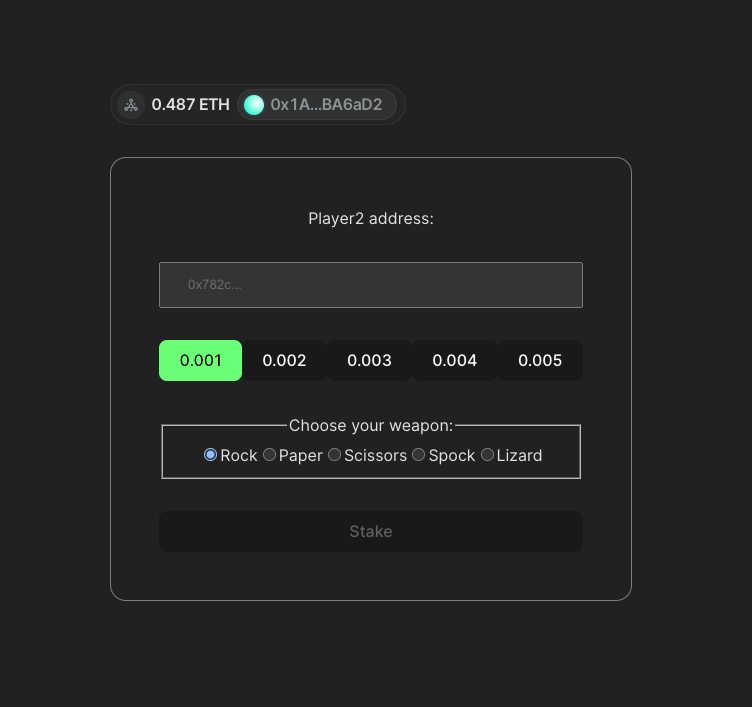

# Rock Paper Scissors Lizard Spock
> RPS game with additional weapons inspired by Big Bang Theory series builded on Ethereum blockchain.
> Live demo link [_here_](https://rps-snowy-zeta.vercel.app/).

## Table of Contents
* [Technologies Used](#technologies-used)
* [Screenshots](#screenshots)
* [Setup](#setup)
* [Areas for Improvement](#areas-for-improvement)
* [Mixed strategy Nash equilibria](#mixed-strategy-nash-equilibria)

## Technologies Used
- React bootstraped by Vite
- React router 6
- ethers.js(Keep It Simple)

## Screenshots

## Setup
Please make sure that your node version > 16

`npm run dev` or `yarn dev`

You can check dev-build on [http://localhost:3000](http://localhost:3000)

## Areas for Improvement
We are very appreciate your pull requests. Do not hesistate to make your contributions.

Areas for improvement:
- Current contract has specific functionality, on j1 timeout j2 can withdraw stakes of both players. To prevent this would be nice to implement auto-submit for j1 if this player away from keyboard.
- Implement React Context state to avoid props drilling.
- Cover by unit-tests
- Fluent design(add toasts, transitions, color scheme and etc)

## Mixed strategy Nash equilibria

| Player1/Player2 | Rock | Paper | Scissors | Spock | Lizard |
|-----------------|------|-------|----------|-------|--------|
| Rock            | 0,0  | -1,1  | 1,-1     | -1,1  | 1,-1   |
| Paper           | 1,-1 | 0,0   | -1,1     | 1,-1  | -1,1   |
| Scissors        | -1,1 | 1,-1  | 0,0      | -1,1  | 1,-1   |
| Spock           | 1,-1 | -1,1  | 1,-1     | 0,0   | -1,1   |
| Lizard          | -1,1 | 1,-1  | -1,1     | 1,-1  | 0,0    |
